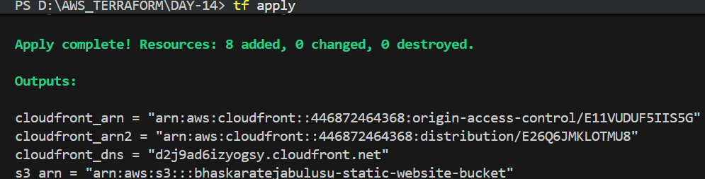
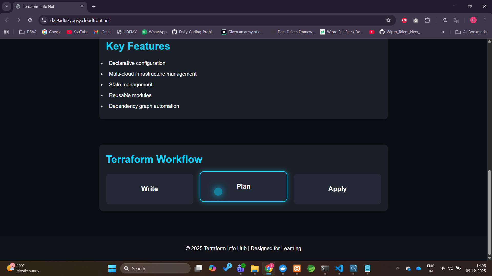

## #30daysofawsterraform - Day 14 : Mini Project - Deploy a Static Website with AWS S3 and CloudFront using Terraform

### Objective

Deploy a static website using AWS S3 for storage and CloudFront for content delivery.

### Prerequisites

* Basic knowledge of Terraform
* AWS account with necessary permissions
* Terraform installed on your local machine
* AWS CLI configured with your credentials

### Steps

1. **Set Up Your Terraform Configuration**
   - Create a new directory for your project and navigate into it.
   - Create a `main.tf` file to define your Terraform configuration.
2. **Define the AWS Provider**
    

```hcl
    provider "aws" {
      region = "us-east-1" # Change to your preferred region
    }
```

3. **Create variables.tf**
    

```hcl
    variable "bucket_name" {
      description = "The name of the S3 bucket to create"
      type        = string
    }
```

4. **Create an S3 Bucket**
    

```hcl
    resource "aws_s3_bucket" "static_website" {
      bucket = var.bucket_name     # Change to a unique bucket name
      
    }
```

4. **Make the Bucket Private**
make the bucket private by blocking all public access   

```hcl
    // Block all public access to the S3 bucket.

  resource "aws_s3_bucket_public_access_block" "block_public_access" {

      bucket = aws_s3_bucket.static_website.id

      block_public_acls = true
      block_public_policy = true
      ignore_public_acls = true
      restrict_public_buckets = true
  }
```

5. **Create a Bucket Policy to Allow Access from CloudFront**
```hcl


    // main.tf
    // Add bucket policy to allow access from another CloudFront 
resource "aws_s3_bucket_policy" "allow_access_from_another_account" {
  bucket = aws_s3_bucket.static_bucket.id // implicit dependency on S3 bucket

depends_on = [aws_s3_bucket_public_access_block.block_public_access]
  policy = local.s3_bucket_policy
}

// locals.tf
// local variables
locals {
    s3_bucket_policy = templatefile(var.bucket_policy_file, {
        bucket_arn = aws_s3_bucket.static_bucket.arn,
        cloudfront_arn = aws_cloudfront_distribution.s3_distribution.arn
    })
}

//variables.tf
// Read bucket policy from json file
variable "bucket_policy_file" {
  description = "The file name that contains the bucket policy in JSON format"
  type        = string
  default = "bucket_policy.json.tmpl"
}

// bucket_policy.json.tmpl
{
  "Version": "2012-10-17",
  "Statement": [
    {
      "Sid": "AllowCloudFrontService",
      "Effect": "Allow",
      "Principal": {
        "Service": "cloudfront.amazonaws.com"
      },
      "Action": [
        "s3:GetObject"
      ],
      "Resource": "${bucket_arn}/*",
      "Condition": {
        "StringEquals": {
          "AWS:SourceArn": "${cloudfront_arn}"
        }
      }
    }
  ]
}

```

6. **Upload Static Website Files**
   - Create a folder named `www` in your project directory and add your static website files (e.g., `index.html`, `styles.css`).
   - Use the `aws_s3_object` resource to upload these files to the S3 bucket.
   

```hcl
    
// Add files to the S3 bucket
resource "aws_s3_object" "static_files" {
    bucket = aws_s3_bucket.static_bucket.id
    for_each = fileset("${path.module}/www","**")
    key = each.value
    source = "${path.module}/www/${each.value}"

    etag = filemd5("${path.module}/www/${each.value}")

    content_type = lookup({
        html = "text/html",
        css  = "text/css",
        js   = "application/javascript",
        png  = "image/png",
        jpg  = "image/jpeg",
        jpeg = "image/jpeg",
        gif  = "image/gif",
        svg  = "image/svg+xml"
    }, split(".", each.value)[length(split(".", each.value)) - 1], "application/octet-stream")
}

    
```

7. **Create Origin Access Identity for CloudFront**

It is an IAM to the resource (example: s3 bucket) where it provides access control to specific origin. 
OAC is related to cloudfront which blocks direct access to the content in s3 bucket ensuring that all the requests are made through designated cloudfront CDN.
   
```hcl

// origin access control for CloudFront
resource "aws_cloudfront_origin_access_control" "cloudfront_oac" {
  name                              = "CloudFront-OAC"
  description                       = "OAC for accessing S3 bucket"
  origin_access_control_origin_type = "s3"
  signing_behavior                  = "always"
  signing_protocol                  = "sigv4"
}
```

8. **Create a CloudFront Distribution**
In this step, we will create a cloudfront distribution to serve the content from the S3 bucket.


```hcl

// create CloudFront distribution
resource "aws_cloudfront_distribution" "s3_distribution" {
  origin {
    domain_name              = aws_s3_bucket.static_bucket.bucket_regional_domain_name
    origin_access_control_id = aws_cloudfront_origin_access_control.cloudfront_oac.id
    origin_id                = var.s3_origin_id
  }

  enabled             = true
  is_ipv6_enabled     = true
  comment             = "Some comment"
  default_root_object = "index.html"  // specify the default root object (home page)


  default_cache_behavior {
    allowed_methods  = ["GET", "HEAD"]  // specify allowed methods from users
    cached_methods   = ["GET", "HEAD"]  // specify cached methods
    target_origin_id = var.s3_origin_id // reference to origin id

    forwarded_values {
      query_string = false // do not forward query strings

      cookies {
        forward = "none" // do not forward cookies
      }
    }

    viewer_protocol_policy = "redirect-to-https" // enforce HTTPS
    min_ttl                = 0
    default_ttl            = 3600
    max_ttl                = 86400
  }

  price_class = "PriceClass_200"  // use price class 200 for cost optimization

  restrictions {
    geo_restriction {
      restriction_type = "none"  // allow access from all geographic locations
    }
  }
  viewer_certificate {
    cloudfront_default_certificate = true  // use default CloudFront certificate for HTTPS
  }
}

// variables.tf

variable "s3_origin_id" {
  default = "S3-StaticWebsiteOrigin"
}
```

8. **Output the CloudFront Domain Name**
   
```hcl
    output "cloudfront_domain_name" {
      description = "The domain name of the CloudFront distribution"
      value       = aws_cloudfront_distribution.s3_distribution.domain_name
    }
```


9. **Initialize and Apply Terraform Configuration**
   - Run `terraform init` to initialize the Terraform configuration.
   - Run `terraform apply` to create the resources. Review the plan and confirm the apply.
    - After the apply is complete, note the CloudFront domain name from the output.
10. **Access Your Static Website**
    - Open a web browser and navigate to the CloudFront domain name to see your static website in action.
    - It will automatically redirect to HTTPS.


### Conclusion
This mini project demonstrated how to deploy a static website using AWS S3 and CloudFront with Terraform. You can further enhance this setup by adding custom domains using Route 53, SSL certificates using AWS Certificate Manager (ACM), and additional security measures as needed.

**Terminal Output:**



**Static Website Accessed via CloudFront:**




Congratulations! You have successfully deployed a static website using AWS S3 and CloudFront with Terraform.
